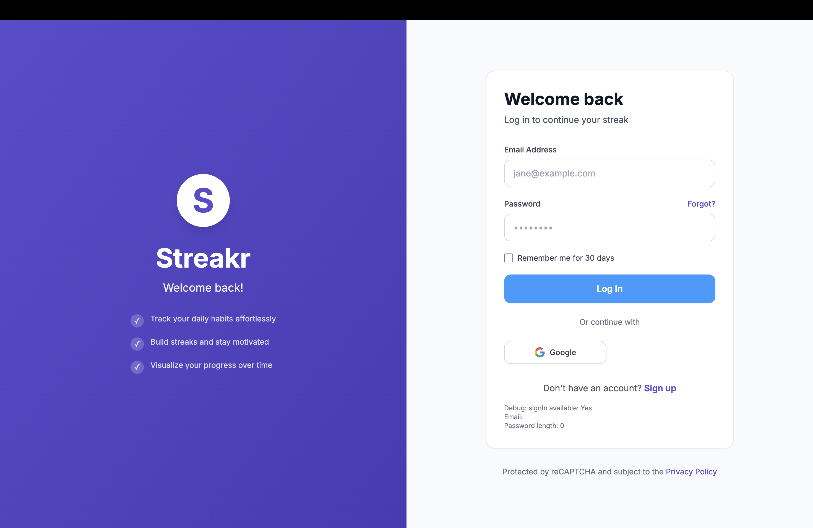

# Habit Tracker Application

A comprehensive habit tracking application built with Next.js and Supabase that helps users build and maintain positive habits through streak tracking, progress visualization, and motivational rewards.

## The Team

- **Evander Blue** - Developer
- **Kerry Ferguson** - Developer  
- **Mattie Weathersby** - Developer
- **Jaizel Cespedes** - Developer

## Screenshot



## Description

The Habit Tracker app is a modern web application designed to help users build and maintain positive habits through gamification and visual progress tracking. Key features include:

- **User Authentication**: Secure sign-up, sign-in, and session management
- **Profile Management**: Customizable user profiles with avatar support
- **Habit Creation & Management**: Create, edit, and delete custom habits with flexible scheduling
- **Streak Tracking**: Visual streak counters with fire emoji indicators
- **Progress Visualization**: Interactive charts and completion history
- **Milestone Rewards**: Badge system and celebratory animations for achievements
- **Motivational Features**: Confetti animations and encouraging messages for streak milestones

Built with modern web technologies including Next.js 15, React 19, Supabase for backend services, Clerk for authentication, and Chart.js for data visualization.

## Demo Link

https://cs-25-2-team1.vercel.app/login

## Installation Instructions

### Prerequisites

- Node.js (version 18 or higher)
- npm or yarn package manager
- Git

1. **Clone the repository:**
   ```bash
   git clone https://github.com/code-differently/cs-25-2-team1.git
   cd cs-25-2-team1/habitTrackerApp
   ```

2. **Install dependencies:**
   ```bash
   npm install
   ```

3. **Environment Configuration:**
   - Copy `.env.local.example` to `.env.local`
   - Configure the following environment variables:
     ```
     NEXT_PUBLIC_SUPABASE_URL=your_supabase_url
     NEXT_PUBLIC_SUPABASE_ANON_KEY=your_supabase_anon_key
     NEXT_PUBLIC_CLERK_PUBLISHABLE_KEY=your_clerk_key
     CLERK_SECRET_KEY=your_clerk_secret
     ```

4. **Database Setup:**
   - Set up Supabase project and configure authentication
   - Run the database migration scripts in `/database/schema.sql`
   - Optionally set up Google Calendar integration using `/database/google-calendar-schema.sql`

5. **Run the development server:**
   ```bash
   npm run dev
   ```

6. **Access the application:**
   - Open [http://localhost:3000](http://localhost:3000) in your browser

### Available Scripts

- `npm run dev` - Start development server
- `npm run build` - Build for production
- `npm run start` - Start production server
- `npm test` - Run test suite
- `npm run test:watch` - Run tests in watch mode
- `npm run test:coverage` - Generate test coverage reports

## Known Issues

*This section will be updated with known issues as they are identified during development and testing.*

## Roadmap Features

### Phase 1 - Core Functionality ✅
- [x] User authentication and profile management
- [x] Basic habit creation and tracking
- [x] Streak counting and completion marking
- [x] Simple progress visualization

### Phase 2 - Enhanced Features 

- [ ] Advanced analytics and reporting
- [ ] Social features (habit sharing, friends)
- [ ] Mobile app development (React Native)
- [ ] Offline synchronization
- [ ] Advanced notification system

### Phase 3 - Integrations 
- [ ] Google Calendar integration
- [ ] Wearable device connectivity (Fitbit, Apple Watch)
- [ ] Third-party app integrations (Strava, MyFitnessPal)
- [ ] AI-powered habit recommendations
- [ ] Voice assistant integration

### Phase 4 - Enterprise Features
- [ ] Team habit tracking for organizations
- [ ] Admin dashboard and analytics
- [ ] Custom branding options
- [ ] API for third-party integrations
- [ ] Advanced security and compliance features

### Future Considerations
- [ ] Habit templates and community sharing
- [ ] Gamification enhancements (leaderboards, challenges)
- [ ] Machine learning for personalized insights
- [ ] Multi-language support
- [ ] Accessibility improvements

## Credits

### Development Team
- **Evander Blue** - Lead Full Stack Developer, Database Design
- **Kerry Ferguson** - Full Stack Developer, Frontend Architecture
- **Mattie Weathersby** - UI/UX Designer, Testing
- **Jaizel Cespedes** - Backend Developer, Integration Development

### Technologies & Libraries
- **Next.js** - React framework for production
- **Supabase** - Backend as a service, database, and authentication
- **Clerk** - Authentication and user management
- **Tailwind CSS** - Utility-first CSS framework
- **Lucide React** - Icon library
- **Chart.js/Recharts** - Data visualization
- **React Confetti** - Celebration animations
- **Jest & React Testing Library** - Testing framework
- **TypeScript** - Type safety and development experience

### Special Thanks
- Code Differently organization for project guidance and mentorship
- The open-source community for the excellent tools and libraries
- All contributors and testers who helped improve the application

---
 
**Repository:** [cs-25-2-team1](https://github.com/code-differently/cs-25-2-team1)  
**Last Updated:** October 2025